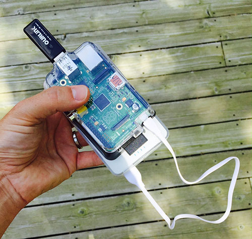

# liblib 

Liblib is a "media" server built on [couchDB](http://couchdb.apache.org/). "Media" is in quotes because the term is being used as loosely as possible (traditional digital items like books, music, video, as well as photos, digital artwork, event archives... really any digital "stuff" you want to keep).  If your "stuff" is on the liblib then anyone can connect to it via wifi and check out what you've got.

One of the things that is cool about liblib is that it (will) automatically sync with other liblibs. This leads to some pretty neat...
 
### [USE CASES](docs/use-cases.md)

NOTE: This project is primarily a specification. However it also contains instructions on how to [create your own](docs/raspberry-pi.md) and an initial implementation.

## In The Wild

* [La Nube Oscura](https://github.com/owise1/kadist-dark-clouds-exhibition) - a mobile video program of contemporary artworks, curated (and carried) by [Joseph del Pesco](http://www.delpesco.com/).

### How to... 

* [Make your own on a Raspberry Pi](docs/raspberry-pi.md)
